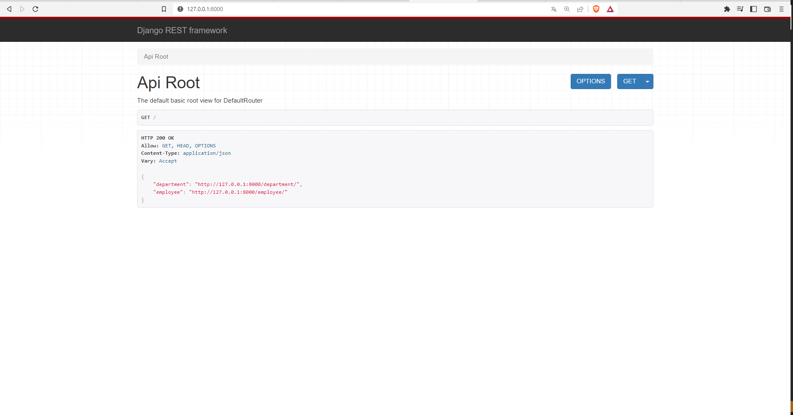
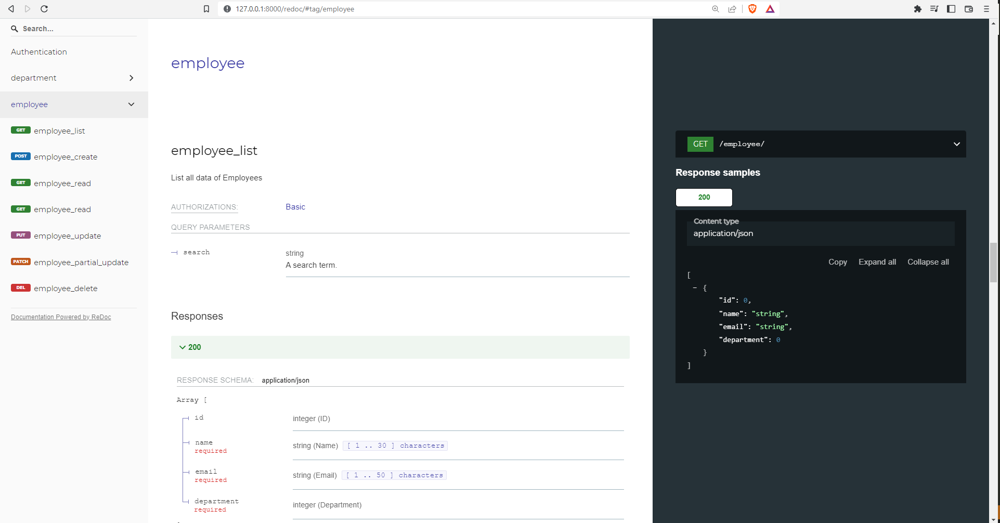
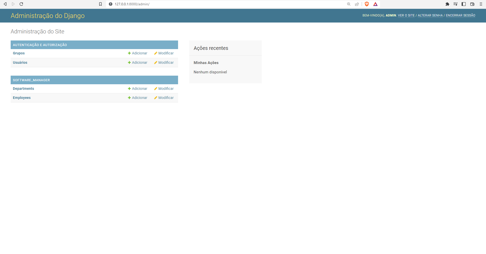
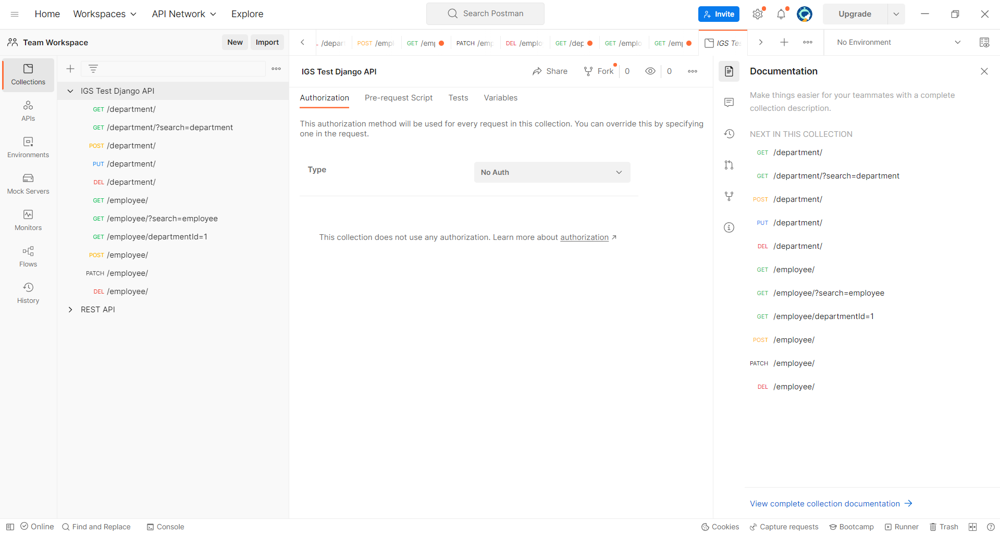

# Django Coding Test - IGS
Developer: Rodrigo Broslavschi de Oliveira
Email: rodrigoliveira132@gmail.com


## Summary 
* [Description Test](#description_test)
* [Usage](#usage)
* [Documentation](#documentation)
* [Tests](#tests)


## Description Test 

The purpose of this coding test is to evaluate your skills using Python and the Django web
framework.
#### The problem
The IGS team is growing every month and now we need to have some applications to
manage employee information, such as name, e-mail, and department. As is the case with
all applications written at IGS, it must have an API to allow integrations.
#### Deliverables
"IGS-Software Manager" app must have:
* A Django admin panel to manage employees and departments data.
* A Django API with methods to:
-- list, add and remove employees
-- list, add and remove departments
* A Django public website (non-admin, without authentication) with a simple table
listing of all registered employees.
#### Acceptance Criteria
* The project code should be delivered to a github.com repository, with instructions
in a README file about how to successfully run it
* There should be independent (but related) models for employee and department
* All fields should be of the most coherent data types and have relevant validators
#### Bonus points!
* Feel free to include additional features in the project if you have the time and
knowledge to do it – like improving testability, readability, delivery, development
environment, or the API documentation

## Usage 

#### Install Librarys
`pip install -r requirements.txt`

#### Run API with my data base 
Someting run
`python manage.py runserver`

#### If you want create a new data base 
Remove my data base db.sqlite3 
`rm db.sqlite3`

and create a new 
```
python manage.py makemigrations
python manage.py migrate
pyhton manage.py createsuperuser
```

Open your API in your browser
`http://127.0.0.1:8000/`


## Documentation 
After run API, open your browser /redoc and /swagger for example: 
`http://127.0.0.1:8000/swagger/`


and 

`http://127.0.0.1:8000/redoc/`


## Administration Data Base
Open your browser 
`http://127.0.0.1:8000/admin`


user = admin
password = admin 

## Tests 
I create many tests on software Postman, and export this tests -> [tests postman](tests/IGS%20Test%20Django%20API.postman_collection.json) 
 

With you whant run tests with django: 
`python manage.py test`